# 03 — Architecture Diagrams

**Product:** Attest
**Document type:** Visual architecture reference — all Mermaid diagrams for the platform.
Companion to `02_Architecture.md`. Diagrams are organized from broadest to most detailed.

> **Design document.** Describes the target architecture. For what is implemented today, see the Status table in the root README.

---

## 1. C4 Level 1 — System Context

Who uses Attest, and what external systems does it touch.

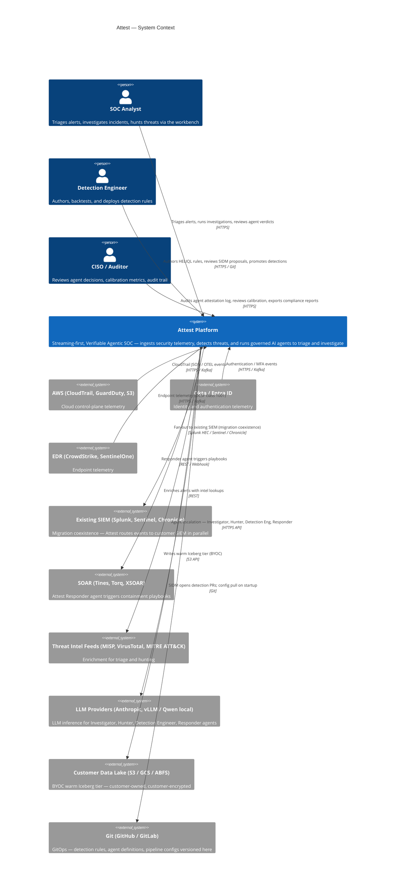

---

## 2. C4 Level 2 — Container Diagram (Six Planes)

The six architectural planes and the containers within each.

```mermaid
C4Container
  title Attest — Container Diagram (Six Planes)

  Person(analyst, "SOC Analyst")
  Person(deteng, "Detection Engineer")

  Boundary(workbench_plane, "Workbench Plane") {
    Container(ui, "SOC Workbench", "Next.js 15, React", "Alert queue, case investigation, time-travel debugger, detection coverage map")
    Container(api, "Control-Plane API", "Rust, Axum", "REST API — hot/warm queries, case CRUD, agent status, audit log")
    Container(ws, "WebSocket Gateway", "Rust, Tokio", "Real-time alert push to workbench")
  }

  Boundary(agentic_plane, "Agentic Plane (VAS)") {
    Container(orchestrator, "Orchestrator", "Rust, Axum :4300", "Hybrid triage loop — classifier path + LLM escalation; routes per agent role")
    Container(policy, "Policy Engine", "Rust (in-process)", "Hard-coded per-role authorization: Allow / Deny / Escalate")
    Container(mcp, "MCP Gateway", "Rust, Axum :4242", "Intercepts every tool call — logs, authorizes, dispatches")
    Container(attest_log, "Attestation Log", "Rust, ndjson", "Append-only Ed25519-signed evidence envelopes")
    Container(ml_sidecar, "ML Sidecar", "Python, FastAPI :5001", "Isotonic calibration; novelty parameters; XGBoost training harness")
    Container(llm_router, "Inference Router", "Rust", "Routes LLM requests: Anthropic API (prod) / vLLM + Qwen (local/air-gap)")
  }

  Boundary(detection_plane, "Detection Plane") {
    Container(heliql, "HELIQL Compiler", "Rust", "Parses detection DSL, compiles to RisingWave SQL / ClickHouse SQL / Arroyo SQL")
    Container(det_runtime, "Detection Runtime", "Rust", "Deploys HELIQL rules, polls materialized views, emits alerts to Redpanda")
    Container(sigma, "Sigma Importer", "Rust", "Converts Sigma YAML → HELIQL AST")
  }

  Boundary(storage_plane, "Storage Plane") {
    ContainerDb(clickhouse, "ClickHouse", "ClickHouse", "Hot OLAP — 7-30d indexed events; also queries warm Iceberg tier")
    ContainerDb(iceberg, "Iceberg / MinIO", "Apache Iceberg + MinIO (dev) / S3 (prod)", "Warm tier — years of OCSF Parquet, customer-owned BYOC")
    ContainerDb(glacier, "S3 Glacier", "AWS Glacier Deep Archive", "Cold tier — 7-year compliance retention")
  }

  Boundary(streaming_plane, "Streaming Plane") {
    Container(collector, "Edge Collector", "Rust, Axum :4000", "Ingests CloudTrail / Okta / EDR JSON, normalizes to OCSF 1.3, produces to Redpanda")
    ContainerDb(redpanda, "Redpanda", "Redpanda / Kafka-compatible :9092", "Event backbone — one topic per source class, 7-day replay buffer")
    Container(risingwave, "RisingWave", "RisingWave :4566", "Streaming SQL — materialized views for baselines, hot-tier detection, entity profiles")
    Container(arroyo, "Arroyo", "Arroyo (Rust)", "Stateful CEP — complex n-event sequence patterns exceeding RisingWave's expressiveness")
    Container(iceberg_writer, "Iceberg Writer", "Rust (attest-storage-iceberg)", "Kafka consumer → Arrow/Parquet batch → MinIO/S3 Iceberg")
  }

  Boundary(control_plane_layer, "Control Plane") {
    Container(idp, "Identity (OIDC)", "Okta / Entra / Auth0", "SSO, SCIM provisioning, per-tenant RBAC")
    Container(gitops, "GitOps", "Git + CI", "Detection rules, agent definitions, pipeline configs — all version-controlled")
    Container(infra, "Infrastructure", "Railway (MVP) / Terraform + EKS/GKE/AKS (BYOC)", "Container orchestration, secrets, networking")
  }

  Rel(analyst, ui, "Uses", "HTTPS")
  Rel(deteng, ui, "Manages detections", "HTTPS")
  Rel(ui, api, "API calls", "HTTPS/JSON")
  Rel(ui, ws, "Live alert stream", "WebSocket")

  Rel(api, clickhouse, "Hot-tier queries", "ClickHouse HTTP :8123")
  Rel(api, orchestrator, "POST /triage, GET /agent", "HTTP")

  Rel(collector, redpanda, "Produces OCSF events", "Kafka producer")
  Rel(redpanda, risingwave, "Kafka source", "Kafka consumer")
  Rel(redpanda, iceberg_writer, "Kafka source", "Kafka consumer")
  Rel(redpanda, arroyo, "Kafka source", "Kafka consumer")
  Rel(redpanda, det_runtime, "alerts topic → API", "Kafka consumer")

  Rel(risingwave, det_runtime, "Polls det_* views", "PostgreSQL")
  Rel(iceberg_writer, iceberg, "Writes Parquet", "S3 API")
  Rel(clickhouse, iceberg, "Queries via Iceberg table function", "S3 API")

  Rel(orchestrator, policy, "authorize(role, tool, ctx)", "in-process")
  Rel(orchestrator, mcp, "Tool calls", "HTTP")
  Rel(orchestrator, attest_log, "append(envelope)", "file I/O")
  Rel(orchestrator, ml_sidecar, "POST /calibrate", "HTTP")
  Rel(orchestrator, llm_router, "LLM escalation", "HTTP")

  Rel(mcp, clickhouse, "query_hot_tier", "ClickHouse HTTP")
  Rel(mcp, risingwave, "get_user_baseline", "PostgreSQL")

  Rel(heliql, risingwave, "CREATE MATERIALIZED VIEW", "PostgreSQL DDL")
  Rel(heliql, clickhouse, "Batch detection SQL", "ClickHouse HTTP")
  Rel(det_runtime, redpanda, "Produces alerts", "Kafka producer")
```

---

## 3. Data Flow — Event Journey (Source → Alert)

How a raw cloud event becomes a fired detection alert.

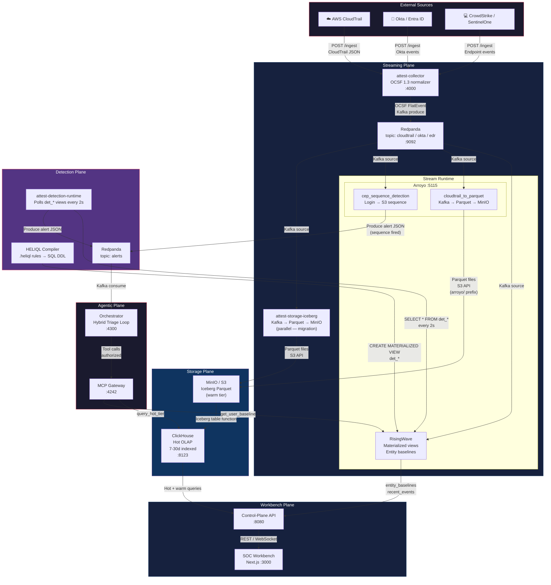

---

## 4. Agentic Plane — Component Diagram

How the five specialist agents, policy engine, MCP gateway, and attestation log are wired together.

```mermaid
flowchart TD
    ALERT["🚨 Incoming Alert\n(from alerts Redpanda topic)"]

    COORD["Coordinator\n(lightweight routing classifier)"]

    subgraph Specialists["Specialist Agents"]
        direction TB
        TRIAGER["Triager\nHybrid path\nXGBoost → LLM escalation"]
        INVEST["Investigator\nClaude Opus / Qwen 32B\nExtended thinking"]
        HUNTER["Hunter\nClaude Opus\nProactive hypothesis"]
        DETENG["Detection Engineer\nClaude Opus (code)\nSIDM loop"]
        RESP["Responder\nClaude Sonnet\nLow temp, constrained"]
    end

    subgraph Governance["Governance Layer"]
        direction LR
        POLICY["Policy Engine\nAuthorize per role+tool+ctx\nAllow / Deny / Escalate"]
        SHADOW["Shadow Check\nDeterministic verify\nbefore destructive actions"]
        ATTEST["Attestation Log\nEd25519-signed envelopes\nappend-only ndjson"]
        CALIB["Calibration\nIsotonic regression\nper role × case-class"]
    end

    subgraph Tools["Tool Layer (via MCP Gateway :4242)"]
        direction TB
        T1["query_hot_tier\n(ClickHouse)"]
        T2["query_warm_tier\n(Iceberg via ClickHouse)"]
        T3["get_user_baseline\n(RisingWave)"]
        T4["lookup_threat_intel\n(external feeds)"]
        T5["get_asset_context\n(CMDB)"]
        T6["sandbox_detonate\n(Phase 7+)"]
        T7["idp_revoke_session\n(Okta API — Responder only)"]
        T8["soar_trigger\n(Tines / Torq)"]
    end

    LLM["LLM Inference Router\nAnthropic API (prod)\nvLLM + Qwen (local)"]

    HUMAN["👤 Human Analyst\n(high-stakes review queue)"]

    ALERT --> COORD
    COORD --> TRIAGER
    COORD --> INVEST
    COORD --> HUNTER
    COORD --> DETENG
    COORD --> RESP

    TRIAGER -->|"raw confidence + features"| CALIB
    CALIB -->|"calibrated score"| TRIAGER
    TRIAGER -->|"low confidence / OOD"| LLM

    INVEST --> LLM
    HUNTER --> LLM
    DETENG --> LLM
    RESP --> LLM

    Specialists -->|"tool call request"| POLICY
    POLICY -->|"Allow"| T1
    POLICY -->|"Allow"| T2
    POLICY -->|"Allow"| T3
    POLICY -->|"Allow"| T4
    POLICY -->|"Allow"| T5
    POLICY -->|"Restrict to Investigator"| T6
    POLICY -->|"Restrict to Responder\n+ shadow check required"| T7
    POLICY -->|"Restrict to Responder"| T8
    POLICY -->|"Deny"| HUMAN

    RESP -->|"destructive action"| SHADOW
    SHADOW -->|"disagrees → pause"| HUMAN
    SHADOW -->|"agrees → execute"| T7

    Specialists -->|"emits signed envelope"| ATTEST

    style Governance fill:#1a1a2e,stroke:#e94560,color:#fff
    style Tools fill:#0f3460,stroke:#533483,color:#fff
    style Specialists fill:#16213e,stroke:#0f3460,color:#fff
```

---

## 5. Sequence — Hybrid Triage Flow

Step-by-step: an alert arrives at the orchestrator, runs the classifier path or escalates to LLM.

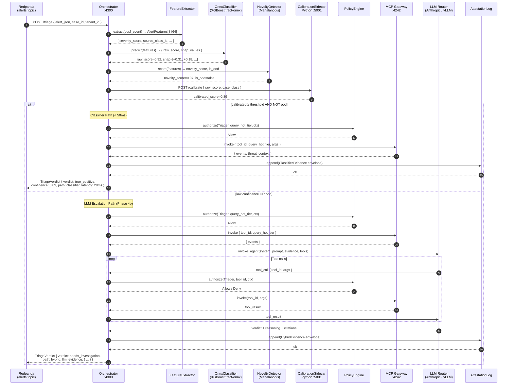

---

## 6. Sequence — HELIQL Detection Lifecycle (SIDM Loop)

How a detection goes from idea to production via the Self-Improving Detection Mesh.

```mermaid
sequenceDiagram
    autonumber
    participant MITRE as MITRE ATT&CK<br/>Knowledge Graph
    participant TI as Threat Intel Feeds
    participant DETENG as Detection Engineer<br/>Agent (Claude Opus)
    participant HELIQL as HELIQL Compiler
    participant RW as RisingWave
    participant CH as ClickHouse (Iceberg)
    participant GIT as Git / PR
    participant HUMAN as Human Detection Eng
    participant PROD as Production Stream

    Note over DETENG: SIDM loop runs continuously
    DETENG->>MITRE: read coverage gaps (which ATT&CK techniques have no detection?)
    MITRE-->>DETENG: uncovered techniques
    DETENG->>TI: read last 7d TTPs, IoCs, CVE chatter
    TI-->>DETENG: active threat patterns

    DETENG->>DETENG: generate proposed HELIQL rule + rationale

    DETENG->>HELIQL: compile(detection_rule)
    HELIQL-->>DETENG: compiled SQL (RisingWave DDL + ClickHouse batch)

    Note over DETENG,CH: Backtest against 90d of warm tier
    DETENG->>CH: run backtest SQL on last 90d Iceberg data
    CH-->>DETENG: { hits: 47, precision: 0.91, recall: 0.88, fp_estimate: 4.2/week }

    DETENG->>GIT: open PR { rule.heliql, rationale.md,<br/>backtest_results.json, mitre_mapping }

    HUMAN->>GIT: review + approve PR
    GIT-->>DETENG: merged

    Note over DETENG,RW: Shadow deploy — 7 days
    DETENG->>HELIQL: compile → shadow DDL
    HELIQL->>RW: CREATE MATERIALIZED VIEW det_shadow_*
    RW-->>DETENG: shadow alerts (not sent to analysts)

    DETENG->>DETENG: measure shadow precision/recall vs. thresholds

    alt Meets promotion thresholds
        DETENG->>HELIQL: compile → production DDL
        HELIQL->>RW: CREATE MATERIALIZED VIEW det_*
        HELIQL->>CH: register batch detection SQL
        Note over PROD: Rule is live in stream + batch
        DETENG->>GIT: commit(promotion_record)
    else Below thresholds
        DETENG->>GIT: open tuning PR with observed FP patterns
    end

    Note over DETENG: Continue monitoring; propose retirement if yield drops
```

---

## 7. Data Tiering Flow

How events are routed through hot → warm → cold tiers based on data class and age.

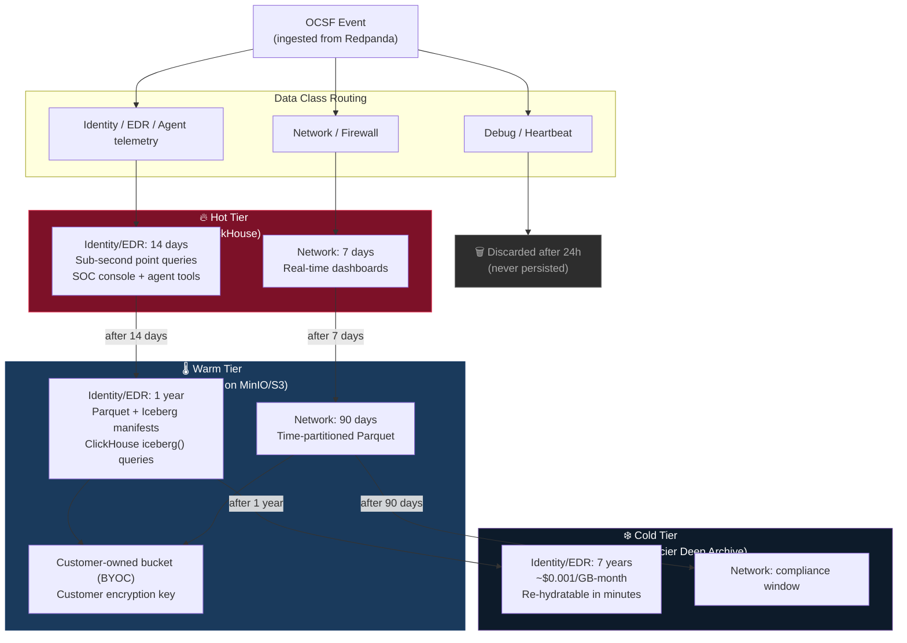

---

## 8. Attestation Envelope — Structure

The three attestation envelope variants and their evidence blocks.

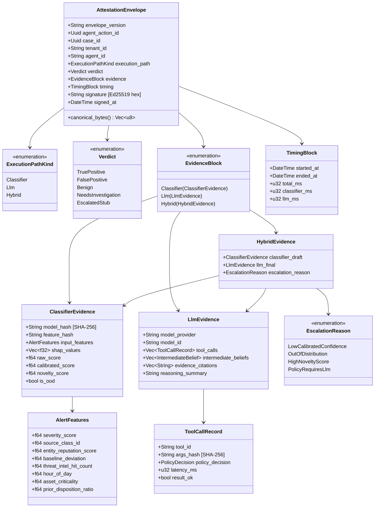

---

## 9. HELIQL Compilation — Multi-Target Flow

How a single HELIQL rule compiles to three execution targets.

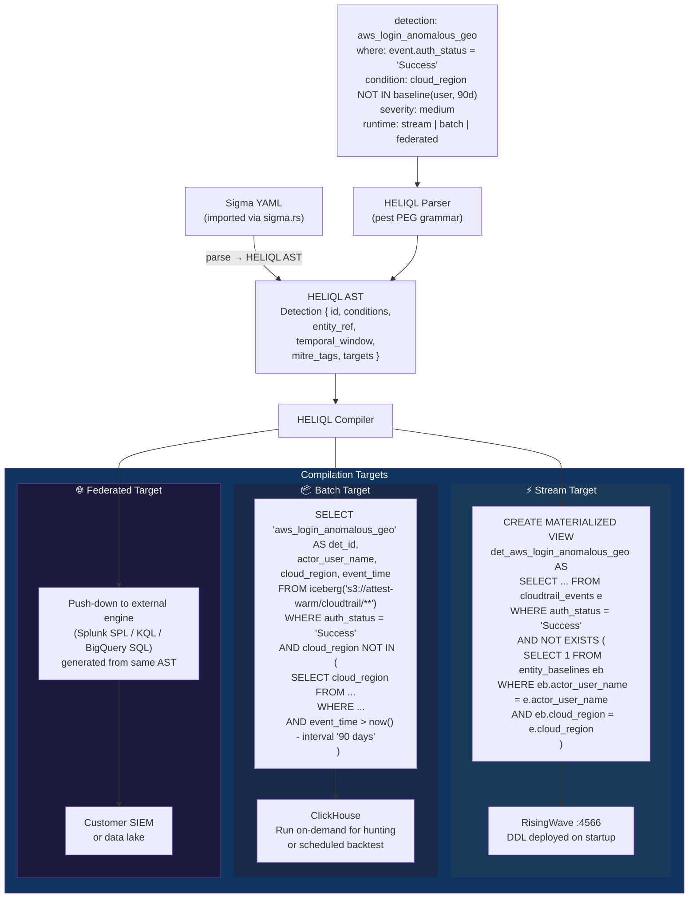

---

## 10. Deployment Topology — Railway MVP

Physical service layout on Railway for a single mid-market tenant.

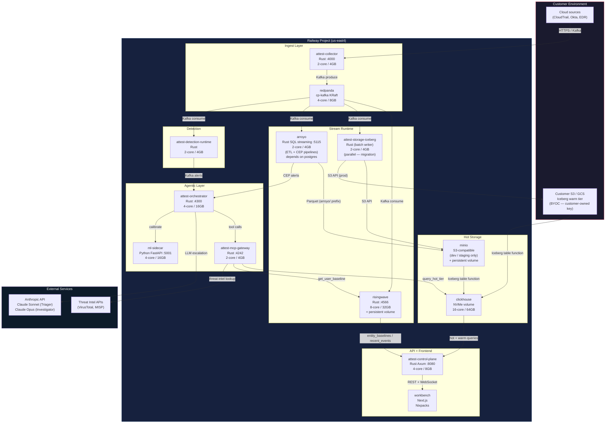

---

## 11. Alert State Machine

Lifecycle of an alert from ingestion through resolution.

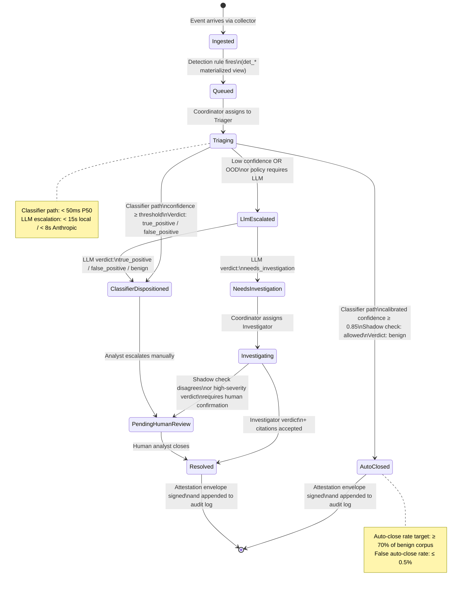

---

## 12. Agent-Aware Detection Fabric (AADF) — New Telemetry Classes

How AI agent telemetry flows through the same Attest platform for AI threat detection.

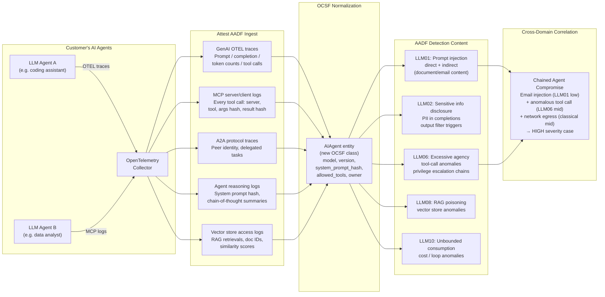

---

## Summary — Diagram Index

| # | Diagram | Type | What it shows |
|---|---|---|---|
| 1 | System Context | C4 L1 | Attest in relation to users and external systems |
| 2 | Container Diagram | C4 L2 | All containers across the six planes |
| 3 | Event Journey | Data flow | Raw cloud event → fired detection alert |
| 4 | Agentic Plane | Component | Five agents, policy engine, MCP, attestation wiring |
| 5 | Hybrid Triage | Sequence | Step-by-step classifier path + LLM escalation |
| 6 | SIDM Loop | Sequence | Detection Engineer agent continuous improvement loop |
| 7 | Data Tiering | Flow | Hot → warm → cold tiering policy by data class |
| 8 | Attestation Envelope | Class | Three evidence variants and their structure |
| 9 | HELIQL Compilation | Flow | Single rule → stream + batch + federated targets |
| 10 | Railway Topology | Deployment | Physical service layout, sizing, connections |
| 11 | Alert State Machine | State | Alert lifecycle from ingestion to resolution |
| 12 | AADF | Flow | AI agent telemetry ingestion and detection content |
